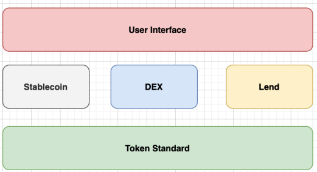

# DFinance

DFinance is aiming to be the DeFi hub of Dfinity Internet Computer, DFinance protocol stack is composed of 4 basic components:

* Token standards
* Decentralized exchange
* Stablecoin
* Lending

We are currently building 4 products:

* DToken: token issuance app, you can issuance your own ERC20 style token on Dfinity with only one click of a button (finished)
* DSwap: AMM decentralized exchange (in progress)
* DUSD: over-collateralized decentralized stablecoin pegged to US Dollar (in progress)
* DLend: borrowing & lending platform (in progress)